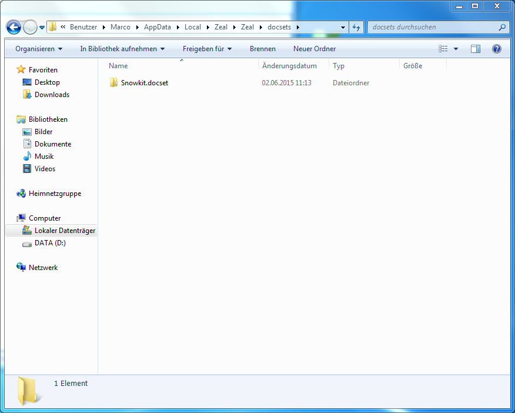
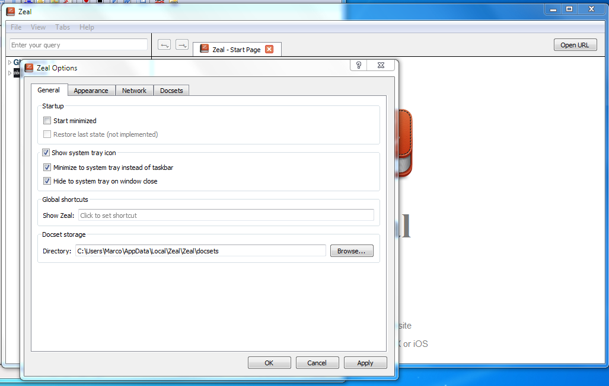
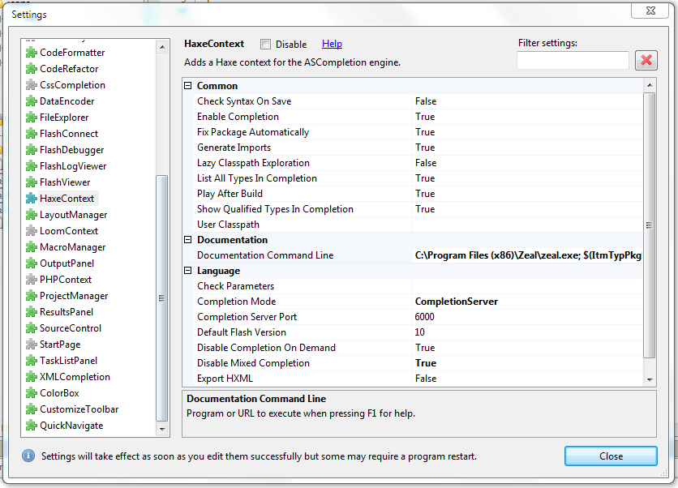
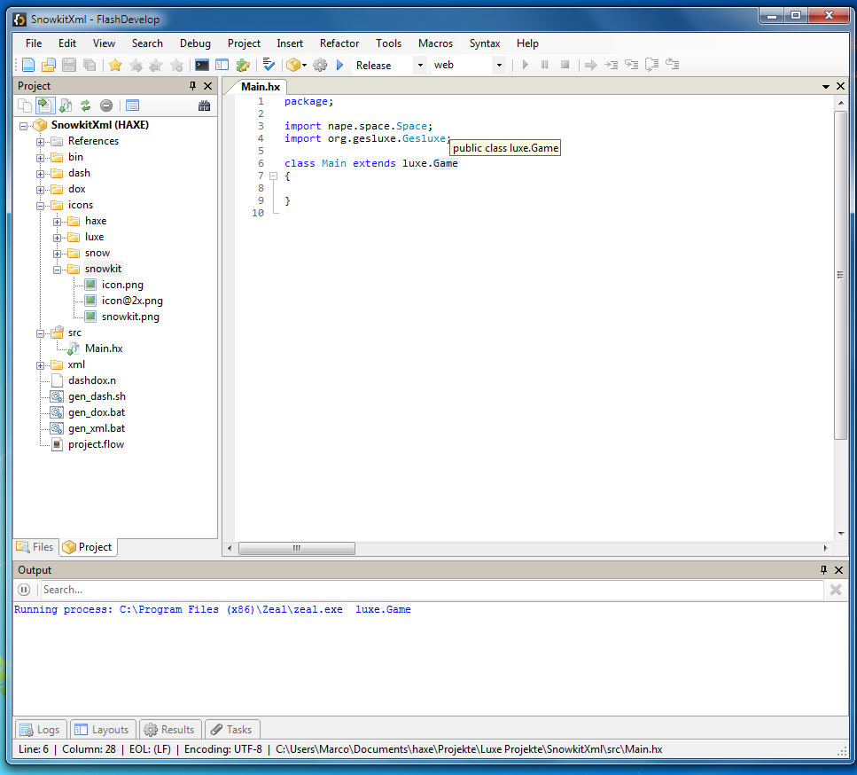
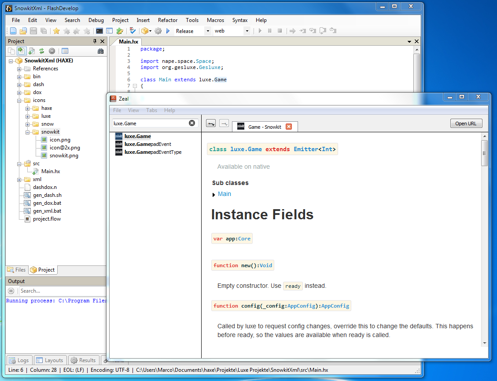

#Snowkit.docset
This repository contains a offline api documention for Luxe, Snow, Nape, Gesluxe and Rainbow.

| Library       | Version       |
| ------------- |---------------|
| [Haxe]        | 3.2.0         |
| [Luxe]        | d0cd40f       |
| [Snow]        | d4d76b8       |
| [Nape]        | dbe6663       |
| [Gesluxe]     | d006820       |
| [Rainbow]     | dd769fb       |
---
## Usage
- **Install** Zeal (Windows, Linux), Dash (commercial, OS X) or Velocity (commercial, Windows)
  - [Zeal](http://zealdocs.org/)
  - [Dash](https://kapeli.com/dash)
  - [Velocity](http://velocity.silverlakesoftware.com/)
- **Download** [snowkit.docset.zip](Snowkit.docset.zip?raw=true)
- **Unzip** and move the folder snowkit.docset to
  - zeal|windows: %LOCALAPPDATA%/Zeal/Zeal/docsets
  - zeal|ubuntu: ~/local/share/zeal/docsets
  - zeal|linux: See zeal settings window for docsets folder location
  - dash|osx: See dash documentation
  - velocity|windows: ~ %UserProfile%\AppData\Local\Silverlake Software LLC\Velocity
  
  

## How to integrate Zeal in Flashdevelop
- Setup Zeal as described above
- Open Zeal Settings (File->Options)
- Set Zeal to minimize to tray and hide to tray on window close so it does not need to restart everytime you need the documentation

  

- Open Flashdevelops Settings (Tools->Program Settings)
- Select the 'HaxeContext' on the left side
- Change the value of 'Documentation Comand Line' to
```bash
C:\Program Files (x86)\Zeal\zeal.exe; $(ItmTypPkgName)
```
  
    
- You can now press F1 when your cursor is over a Haxe Type to open the documentation

  
  
  

[Haxe]: https://github.com/HaxeFoundation/haxe
[Luxe]: https://github.com/underscorediscovery/luxe
[Snow]: https://github.com/underscorediscovery/snow
[Nape]: https://github.com/deltaluca/nape
[Gesluxe]: https://github.com/josuigoa/gesluxe
[Rainbow]: https://github.com/Dvergar/rainbow
